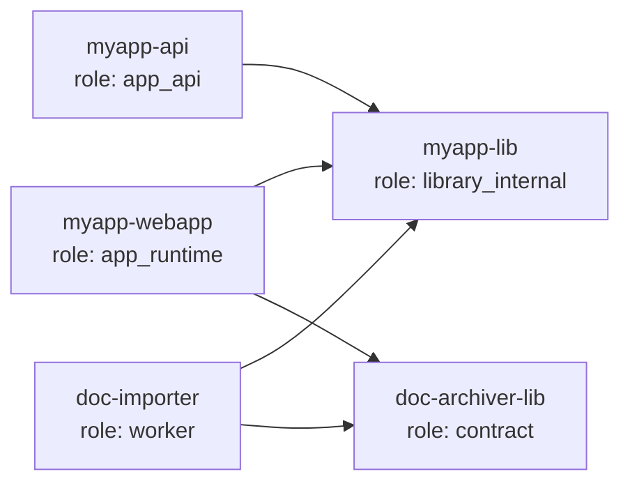
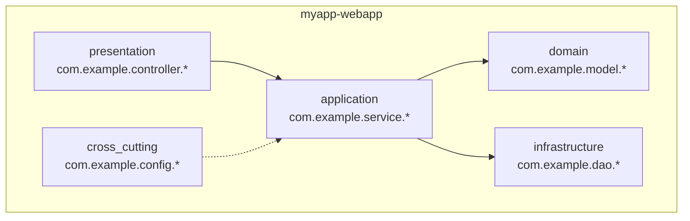

# Logical Boundaries (Pass 2 / 9)

## Purpose

Turn the raw inventory of P1 into a logical map of the codebase: modules, packages, namespaces, layers and the architectural pattern (or lack thereof) that holds them together.

This pass produces the **silos** that P3 (feature candidates) and P4 (silo deep dive) will explore one by one.

It does not yet talk about features or business behavior. It only describes how the code is **organized**.

## Prerequisite

`doc/_meta/code-pipeline-state.yaml` → `p1_tree_inventory.status == covered`.

If P1 is `partial` or `blocked`, do not start P2. Re-run P1 first.

## Mandatory first reads

1. `doc/_meta/code-inventory.yaml`
2. `doc/_meta/code-inventory.md`
3. `doc/_meta/code-pipeline-state.yaml`
4. All build manifests listed by P1 (`pom.xml`, `build.gradle`, `package.json`, `*.csproj`, etc.)
5. Workspace files (`pnpm-workspace.yaml`, `lerna.json`, `nx.json`, `turbo.json`, `go.work`, `Cargo.toml [workspace]`)
6. Module declaration files (`module-info.java`, `index.ts` barrel files, `__init__.py`, `mod.rs`)

## Required behavior

1. From the build manifests, list every declared module/package/project.
2. For each module, classify its **role** and **layer** using the taxonomies below.
3. Detect the **architectural style** by evidence (not by guess).
4. Detect cross-module **dependencies** from build manifest declarations only at this stage. Code-level dependency analysis is P5/P7.
5. Mark every module with a primary purpose, a stack and an entry-point hint.
6. Where the build does not declare modules (e.g. flat Python), derive logical boundaries from package/namespace structure.

## Module role taxonomy

| Role | Meaning |
|---|---|
| `app_runtime` | A deployable artifact (web app, service, daemon, batch container). |
| `app_ui` | UI-only deliverable (SPA, mobile bundle, JSF webapp). |
| `app_api` | API-only deliverable (REST/gRPC/SOAP backend). |
| `worker` | Background consumer/scheduler/batch worker. |
| `cli` | CLI tool. |
| `library_internal` | Reusable code shared between modules in this repo. |
| `library_published` | Library intended for external consumption. |
| `contract` | Schema/IDL/contract module (proto, openapi, avro, wsdl). |
| `test_only` | Only tests, fixtures, harnesses. |
| `infra` | Build/CI/deploy code, no app runtime. |
| `legacy` | Code marked deprecated or in active sunset. Evidence required. |
| `unknown` | Cannot be classified. Must be resolved or asked. |

## Layer taxonomy (when applicable)

For object-oriented / layered codebases, classify each package within a module:

| Layer | Hints |
|---|---|
| `presentation` | controllers, views, components, pages, screens, route handlers |
| `application` | use-cases, services, command/query handlers, facades |
| `domain` | entities, aggregates, value objects, domain events, business rules |
| `infrastructure` | repositories, external clients, persistence, messaging adapters |
| `cross_cutting` | logging, security, config, error handling, i18n |
| `interface_in` | DTOs/requests received from outside |
| `interface_out` | DTOs/messages sent outside |
| `bootstrap` | Spring `@Configuration`, DI wiring, `main()` |

For non-OO / functional / module-based codebases, use the equivalent (e.g. `handler`, `service`, `repo`, `client`, `wiring`).

## Architectural style detection

Look for evidence of one of these patterns. Record the pattern and the **evidence trail**, never an assumption.

| Style | Evidence |
|---|---|
| Layered / N-tier | Explicit `controller/service/repository` packages, DTO layers between them. |
| Hexagonal / Ports & Adapters | `domain/`, `application/ports/`, `application/usecases/`, `adapters/in/`, `adapters/out/`, ports as interfaces. |
| Clean Architecture | `entities/`, `usecases/`, `interface-adapters/`, `frameworks-drivers/`. |
| DDD bounded contexts | Bounded-context folders with their own `domain/`, `infrastructure/`, ubiquitous language traces. |
| Modular monolith | One deployable module that internally enforces module boundaries (Spring Modulith, NestJS modules, Java modules). |
| Microservices in monorepo | Multiple `app_runtime` siblings with isolated configs and contracts. |
| Feature-sliced | `features/<name>/{ui,api,model}` or `pages/`+`features/`+`entities/` (Feature-Sliced Design). |
| MVC framework default | Convention from the framework (Laravel, Rails, Django, ASP.NET MVC). |
| Plugin/extensible | Plugin loader, SPI/ServiceLoader, dynamic module registry. |
| Procedural / scripted | No clear separation; flat scripts. |
| Mixed / inconsistent | Multiple styles coexist. **Must be flagged for P7.** |
| Unknown | Insufficient signal. Ask the operator. |

If the codebase shows several styles, record `mixed` and list **each subsystem with its own style**. Do not invent a unifying narrative.

## Cross-module dependency map

From build manifests only:

```yaml
dependencies:
  - from: "myapp-webapp"
    to: "myapp-lib"
    declared_in: "myapp-webapp/pom.xml"
    scope: "compile|runtime|test|provided|optional"
  - from: "myapp-webapp"
    to: "doc-archiver-lib"
    declared_in: "myapp-webapp/pom.xml"
    scope: "compile"
```

Detect **cycles** at this stage from declared dependencies. Record them. P7 will look for code-level cycles.

## Output files

```text
doc/_meta/logical-boundaries.yaml                         # machine-readable module/layer/dep map
doc/project/architecture/MODULES.md                       # one section per module, role + layer + stack
doc/project/architecture/LAYERS.md                        # how layers are used across modules (when applicable)
doc/project/architecture/ARCH_STYLE.md                    # detected pattern(s) with evidence
doc/project/architecture/diagrams/modules-deps.md         # mermaid: declared module dependency graph
doc/project/architecture/diagrams/layers.md               # mermaid: layer stack per module
doc/project/architecture/diagrams/arch-style.md           # mermaid: arch style block diagram
doc/_meta/code-pipeline-state.yaml                        # P2 status updated
```

## Mandatory diagrams

P2 must produce **at least three diagrams**, all generated from code/build evidence (no Confluence-sourced shapes). Use Mermaid for portability and git-rendering. Embed each diagram inline in its `.md` file with a short legend, the input evidence (`logical-boundaries.yaml` section that produced it) and the date.

### Diagram 1 — Module dependency graph (`diagrams/modules-deps.md`)

A `graph LR` of modules and declared dependencies. Color/style legacy modules differently. Highlight cycles in red.



### Diagram 2 — Layer stack per module (`diagrams/layers.md`)

For each `app_runtime`/`app_api`/`worker` module, a `flowchart TB` showing the layer stack (presentation → application → domain → infrastructure → cross-cutting), with the actual package names as node labels. One block per module, separated by horizontal rules.



### Diagram 3 — Architectural style block diagram (`diagrams/arch-style.md`)

A single high-level diagram of the detected primary architectural style. Show the canonical blocks of that style (e.g. for hexagonal: domain core in the centre, ports as boundaries, adapters around). Annotate each block with the **actual package or module path** that fills it. If the style is `mixed`, draw one block diagram per subsystem.

### Diagram presentation rules

- Inline Mermaid only. No external image files.
- Each diagram file starts with frontmatter `type: diagram, source: code, generated_from: <pipeline pass>`.
- Each diagram has a one-paragraph legend below explaining how to read it and which `logical-boundaries.yaml` section it was generated from.
- Diagrams are never sourced from Confluence pages. If a Confluence diagram exists for the same scope, reference it under "External references" but do not import its shapes — Confluence is rank 7, code is rank 1.
- A diagram out of sync with the YAML state is a P0 reconciliation issue caught by P9.

### `logical-boundaries.yaml` schema

```yaml
modules:
  - id: "myapp-webapp"
    path: "myapp-webapp/"
    role: "app_runtime"
    primary_language: "java"
    primary_framework: "spring-boot:2.2.6+jsf"
    declared_in: "myapp-webapp/pom.xml"
    entry_point_hint: "com.example.MyAppApplication"
    layers_present: [presentation, application, infrastructure, bootstrap]
    sub_packages:
      - name: "com.example.controller"
        layer: "presentation"
        file_count: <int>
      - name: "com.example.service"
        layer: "application"
        file_count: <int>
    notes: ""
architectural_style:
  primary: "layered"
  evidence:
    - "controller/service/repository packages exist in myapp-webapp"
    - "DTOs separate from entities (com.example.dto vs com.example.lib.entity)"
  secondary: []
  inconsistencies: []                        # flagged for P7
dependency_graph:
  edges:
    - from: "myapp-webapp"
      to: "myapp-lib"
      scope: "compile"
  cycles: []                                 # populated if any
boundary_violations_suspected: []            # populated only with concrete evidence
```

## Coverage targets (gate for P2 → covered)

| Metric | Target | Hard gate |
|---|---|---|
| Modules from P1 inventory mapped to a role | 100% | yes |
| Modules with `role: unknown` | 0 (or each one has a blocking question) | yes |
| Each module has a layer breakdown OR explicit "not applicable" with reason | 100% | yes |
| Architectural style recorded with at least 2 evidence items | yes | yes |
| Cross-module dependencies extracted from every build manifest found in P1 | 100% | yes |
| Declared cycles listed (even if empty array, must be present) | yes | yes |
| Module dependency diagram present (`diagrams/modules-deps.md`) with mermaid block | yes | yes |
| Layer stack diagram present (`diagrams/layers.md`) with one block per `app_runtime`/`app_api`/`worker` module | yes | yes |
| Architectural style diagram present (`diagrams/arch-style.md`) | yes | yes |

## Reconciliation duties

If P1 listed multiple build systems for the same module (e.g. `pom.xml` AND `build.gradle`), record both and **flag the contradiction** in `logical-boundaries.yaml` under `boundary_violations_suspected`.

If a `legacy` module is declared, record the evidence (deprecation comment, `@Deprecated`, README mention, last commit older than N months as a hint only).

## Blocking questions to ask

Use `governance/blocking-question-loop` for:

- a module the build declares but no source files were found in P1;
- two architectural styles in evidence — ask which one is the **target** vs. the legacy;
- a module with `role: unknown` after build manifest reading;
- modules with no entry point hint and no clear consumer.

## Status update

```yaml
pipeline:
  p2_logical_boundaries:
    status: covered|partial|blocked
    last_run: "..."
    modules_mapped: <int>
    modules_unknown: <int>
    architectural_style_recorded: true|false
    cycles_detected: <int>
    blocks_next_pass: true|false
```

## Anti-patterns

Do not:

- claim an architectural style without listing evidence files;
- invent layers that the code does not show (e.g. claim "hexagonal" when there are no ports/adapters folders);
- merge multiple modules into one because their names look similar;
- skip a module because it is small;
- proceed to P3 with `modules_unknown > 0` and no blocking questions opened.
