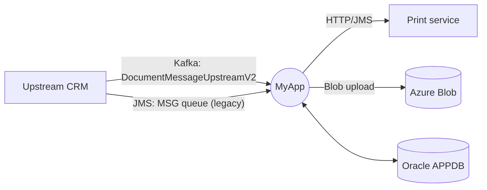

# Cross-Cutting Extraction (Pass 5 / 9)

## Purpose

Aggregate everything that crosses feature boundaries: the **API surface**, the **domain model**, the **integration map**, the **messaging topology**, the **persistence schema** and the **shared infrastructure**.

P4 documented features one by one. P5 looks at the *seams* between them and produces canonical catalogs that no single feature folder owns.

## Prerequisite

`p4_feature_silo_deep_dive.status == covered`.

P5 may be re-run if P4 changes after a `split`/`merge`.

## Mandatory first reads

1. `doc/_meta/code-inventory.yaml`
2. `doc/_meta/logical-boundaries.yaml`
3. `doc/_meta/feature-candidates.yaml`
4. Every `doc/project/features/<slug>/_evidence.yaml`
5. All migration files listed by P1 in `data_migration`
6. All schema/contract files listed by P1 in `proto_schema`
7. All `config_app` files listed by P1
8. `doc/_meta/code-activity-signals.yaml` (if it exists — see Prioritization input below)

## Prioritization input

If `doc/_meta/code-activity-signals.yaml` exists with `meaningful_history: true`, use it to **order entries within each catalog**. Coverage is still exhaustive over P1's inventory — every API, every entity, every integration, every messaging topic, every persistence target is catalogued. But within each catalog file, **list active entries first** (ranked by aggregate folder score of the implementing code), with dormant entries grouped at the end under a clearly marked section ("Dormant / no activity in window").

When the signal is missing or `meaningful_history: false`, fall back to module-order then alphabetical and note the fallback in the catalog's header.

This matters because P5 catalogs are large and read often — the operator and downstream agents land on the first entries by default. Putting active entries first makes those landings useful.

## Required behavior

Produce six canonical catalogs from the union of P4 evidence + the schema/migration/config files. Each catalog must be **exhaustive over the inventory of P1**, not just the union of what P4 happened to read.

## Catalog 1 — API surface

Every inbound contract the application exposes:

```text
doc/project/apis/CATALOG.md
doc/project/apis/<group>/<endpoint>.md      # one file per non-trivial endpoint group
```

For each endpoint, record:

- protocol (HTTP/REST, GraphQL, gRPC, SOAP, WebSocket, server action);
- route/method/operation name;
- request schema (cite DTO file);
- response schema;
- auth requirement;
- consumed by (when known from operator interview);
- feature folder back-reference;
- versioning strategy if present.

Coverage target: every entry point of kind `http_route`, `graphql_resolver`, `grpc_method`, `soap_endpoint`, `websocket_handler`, `server_action` from P3 must appear in CATALOG. **Zero missing.**

## Catalog 2 — Domain model

Every business entity the code persists or transports:

```text
doc/project/domain/ENTITIES.md            # one row per entity
doc/project/domain/<entity>.md            # one file per important entity
doc/_indexes/by-business-entity.md        # updated
```

For each entity, record:

- canonical name;
- physical table(s) and column list (from migrations + ORM annotations);
- key fields, FKs, unique constraints;
- value objects / embedded types;
- enums used;
- features that read it / write it (back-references to feature folders);
- lifecycle (creation/update/deletion paths);
- audit/history columns if present.

Coverage target: every entity class found in source AND every table found in migrations must appear. **Zero missing.** Discrepancies (entity without table or table without entity) are flagged for P7/P9.

## Catalog 3 — Integration map

Every outbound or inbound link between this app and another system:

```text
doc/project/architecture/INTEGRATION_MAP.md
```

For each integration, record:

- direction (inbound, outbound, bidirectional);
- protocol;
- counterpart system (name from operator if not in code);
- contract reference (WSDL/OpenAPI/proto/topic name);
- auth mechanism;
- sync vs. async;
- error handling strategy;
- feature folders that use it.

Coverage target: every external client class, every Kafka/JMS/RabbitMQ/SQS topic referenced, every webhook URL configured, every external HTTP host found in config — all listed.

## Catalog 4 — Messaging topology

Specifically for async messaging (often mis-documented):

```text
doc/project/services/MESSAGING.md
```

For each topic / queue / subscription / exchange, record:

- name;
- broker (Kafka cluster, ActiveMQ broker, RabbitMQ vhost, etc.);
- producers in this repo (file:line);
- consumers in this repo (file:line);
- message class (DTO);
- retry/DLQ policy;
- ordering / partition key (if applicable);
- volume hint if Dynatrace data exists (link to prod snapshot).

Coverage target: every `@KafkaListener`, `@JmsListener`, `KafkaTemplate.send`, `JmsTemplate.convertAndSend` call, and equivalents across stacks, must be in the table.

## Catalog 5 — Persistence schema

```text
doc/project/architecture/PERSISTENCE.md
```

Sections:

- Database engines used (with version when detectable);
- Schemas/databases/keyspaces;
- Tables list with row count hint if known;
- Migration tooling (Flyway, Liquibase, Alembic, EF migrations, custom);
- Migration timeline (count + first/last date);
- Connection pools and their config (size, timeout);
- Read replicas / sharding / partitioning evidence;
- Caches in front of the DB (Redis, Caffeine, Hazelcast);
- Triggers, stored procedures, materialized views.

## Catalog 6 — Shared infrastructure & cross-cutting

```text
doc/project/technical/CROSS_CUTTING.md
```

Sections:

- Authentication & authorization stack (libraries, providers, scopes/roles);
- Configuration management (where config comes from: env, vault, config server);
- Secrets handling;
- Observability stack (logging framework + format, metrics, tracing);
- Internationalization;
- Error handling / global exception mappers;
- Rate limiting / circuit breakers;
- Caching layers;
- Feature flags;
- Audit/compliance hooks.

## Output files

```text
doc/project/apis/CATALOG.md
doc/project/apis/<group>/*.md
doc/project/domain/ENTITIES.md
doc/project/domain/<entity>.md
doc/project/architecture/INTEGRATION_MAP.md
doc/project/architecture/PERSISTENCE.md
doc/project/services/MESSAGING.md
doc/project/technical/CROSS_CUTTING.md
doc/project/architecture/diagrams/integration-context.md   # mermaid C4-context: this app + neighbors
doc/project/architecture/diagrams/integration-flow.md      # mermaid: inbound/outbound flows by protocol
doc/project/architecture/diagrams/messaging-topology.md    # mermaid: producers/topics/consumers
doc/project/architecture/diagrams/domain-er.md             # mermaid erDiagram: entities + relations
doc/project/architecture/diagrams/persistence.md           # mermaid: db engines, schemas, tables grouped
doc/_indexes/by-api.md                    # rebuilt from CATALOG
doc/_indexes/by-business-entity.md        # rebuilt from ENTITIES
doc/_indexes/by-component.md              # cross-cutting components
doc/_meta/cross-cutting-state.yaml
doc/_meta/code-pipeline-state.yaml        # P5 status
```

## Mandatory diagrams

P5 must produce **at least five diagrams**, all generated from code/migration/config evidence (rank 1–2 only). Inline Mermaid in their `.md` files, with frontmatter `type: diagram, source: code` and a legend pointing back at the YAML/MD section that produced them.

### Diagram 1 — Integration context (`diagrams/integration-context.md`)

C4-context-like view: this application as a single block in the centre, every neighbour system from `INTEGRATION_MAP.md` around it, edges labelled with protocol + direction.



### Diagram 2 — Integration flow detail (`diagrams/integration-flow.md`)

Sequence diagrams (one per major flow) for the canonical integrations. Examples: archiving (Kafka path), duplicate send, mass-download generation. Use `sequenceDiagram`. Cite the entry point file under each diagram.

### Diagram 3 — Messaging topology (`diagrams/messaging-topology.md`)

For every broker mentioned in `MESSAGING.md`, a `flowchart LR` with producers on the left, topic/queue in the middle, consumers on the right. Mark DLQs and retry counts on the edges. One sub-diagram per broker.

### Diagram 4 — Domain ER (`diagrams/domain-er.md`)

A `erDiagram` showing the entities from `ENTITIES.md` and their FK relations from migration evidence. Group by bounded context if any are detected. Annotate with cardinalities. If the model is too large for one diagram, split per bounded context — one ER per context.

### Diagram 5 — Persistence map (`diagrams/persistence.md`)

A `flowchart TB` showing: DB engines → schemas/databases → tables (grouped). Add caches, read replicas, search engines as side blocks. Annotate connection pool sizes from config when present.

### Diagram presentation rules

Same rules as P2:

- Inline Mermaid only.
- Frontmatter `type: diagram, source: code`, never `confluence`.
- Legend below each diagram referencing the YAML/MD section it derives from.
- A diagram out of sync with `cross-cutting-state.yaml` is a P9 reconciliation issue.
- If a Confluence page contains a diagram for the same scope, link it under "External references" — do not import its shapes.

### `cross-cutting-state.yaml` schema

```yaml
api_surface:
  endpoints_total: <int>
  endpoints_documented: <int>
  endpoints_missing_consumer_info: <int>
domain_model:
  entities_total: <int>
  tables_total: <int>
  entity_without_table: []           # discrepancies
  table_without_entity: []
integration_map:
  integrations_total: <int>
  inbound: <int>
  outbound: <int>
  contracts_resolved: <int>
  contracts_unknown: <int>
messaging:
  topics_queues_total: <int>
  producers_referenced: <int>
  consumers_referenced: <int>
  dlq_configured: <int>
  ordering_documented: <int>
persistence:
  databases: []
  migrations_total: <int>
  migration_tool: ""
cross_cutting:
  auth_stack: ""
  observability_stack: ""
  feature_flags_system: ""
```

## Coverage targets (gate for P5 → covered)

| Metric | Target | Hard gate |
|---|---|---|
| Every entry point from P3 with API kind appears in CATALOG | 100% | yes |
| Every entity class + every migration table covered in ENTITIES | 100% | yes |
| Every external client / topic / queue listed in INTEGRATION_MAP or MESSAGING | 100% | yes |
| Every cross-cutting concern section written or marked "not present" with evidence | 100% | yes |
| All discrepancies (entity without table, etc.) recorded for P9 | 100% | yes |
| Integration context diagram present (`diagrams/integration-context.md`) | yes | yes |
| Integration flow diagrams present (`diagrams/integration-flow.md`, ≥ 1 sequence diagram) | yes | yes |
| Messaging topology diagram present (`diagrams/messaging-topology.md`) when MESSAGING has any topic/queue | yes | yes |
| Domain ER diagram present (`diagrams/domain-er.md`) when entities exist | yes | yes |
| Persistence map diagram present (`diagrams/persistence.md`) | yes | yes |

## Blocking questions

Use `governance/blocking-question-loop` for:

- A topic/queue with no consumer in repo → ask whether the consumer is in another repo.
- An entity with no table → ask if it is in-memory only or persisted via NoSQL.
- A configured external host not used in code → ask if it is dead config or used at runtime by an admin tool.
- An auth provider URL with no obvious integration code → ask if SSO is handled by infra.

## Status update

```yaml
pipeline:
  p5_cross_cutting_extraction:
    status: covered|partial|blocked
    last_run: "..."
    catalogs_completed: ["api","domain","integration","messaging","persistence","cross_cutting"]
    discrepancies_recorded: <int>
    blocks_next_pass: true|false
```

## Anti-patterns

Do not:

- copy a feature's local API list into the global CATALOG without verifying nothing else is missing;
- treat ENTITIES as "the JPA entities" only — physical tables count too;
- skip MESSAGING because the app "doesn't really use Kafka much";
- write CROSS_CUTTING from memory instead of from config files;
- proceed to P6 with discrepancies unrecorded.
