# Pattern: State Machine Mermaid

**Where**: `WORKFLOWS.md`, "State machine" section at the end (if the feature has states).

**Purpose**: Visual representation of all states and transitions. The single source of truth visually.

## Template

```markdown
## State machine

### States

- `<STATE_A>` — <one-line description>. <Transient | Terminal | Reversible>.
- `<STATE_B>` — <description>.
- `<STATE_C>` — <description>. Terminal.

### Transition diagram

```mermaid
stateDiagram-v2
    [*] --> <INITIAL>: <action>
    <INITIAL> --> <NEXT>: <trigger>
    <INITIAL> --> <ALTERNATE>: <trigger> (<BR-NN>)

    <NEXT> --> <ACTIVE>: <trigger>
    <NEXT> --> <NEXT_BACK>: <trigger> (retry possible)

    <ACTIVE> --> <SUSPENDED>: <trigger> (<BR-NN>)
    <ACTIVE> --> <TERMINAL_A>: <trigger>
    <ACTIVE> --> <TERMINAL_B>: <trigger> (<BR-NN>, if condition)

    <SUSPENDED> --> <ACTIVE>: <trigger>
    <SUSPENDED> --> <TERMINAL_A>: <trigger> (<BR-NN>)

    <TERMINAL_A> --> [*]
    <TERMINAL_B> --> [*]
```


```

## Real example

See `doc/project/features/_example-cross-channel-request/WORKFLOWS.md` "State machine" section with 7 states and 14 transitions.

## Anti-patterns

- Diagram without state descriptions: missing context
- No BR-NN references on transitions: traceability lost
