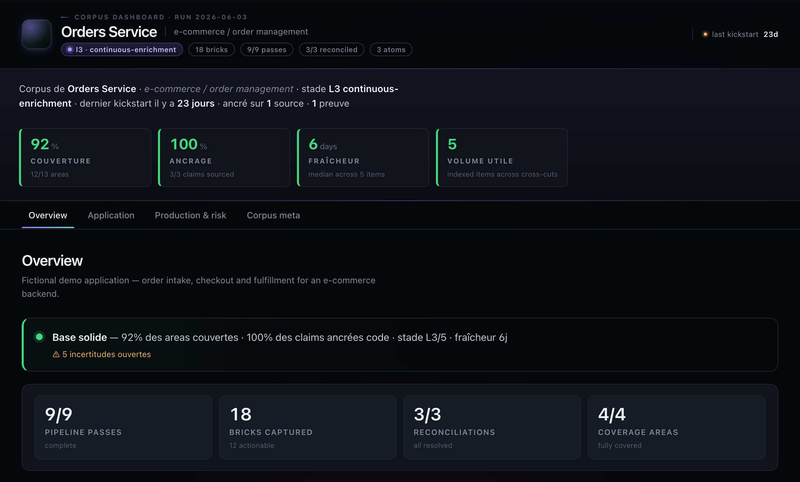
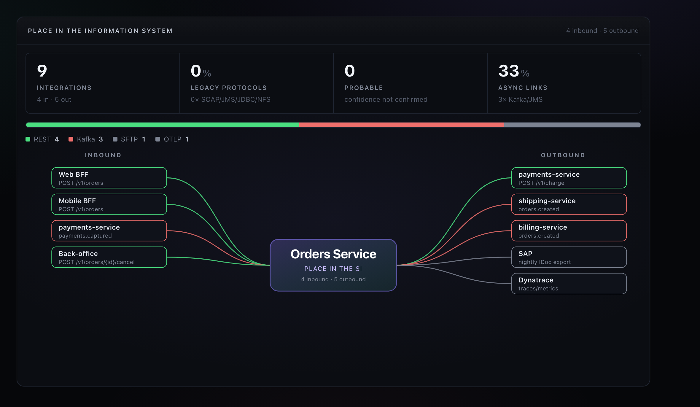
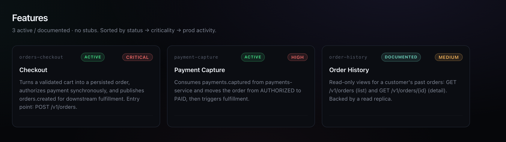

# Application Corpus Agent Pack

**Turn an existing codebase into an agent-readable knowledge base — built from the code as the source of truth, enriched from your live tooling via MCP, and linked across your application ecosystem.**



Drop the pack into a repository and the `Corpus` agent retro-documents it from the code — features, APIs, batches, integrations, data model — then **enriches that spine from your connected ecosystem**: production observability (Dynatrace/APM), Jira/Confluence, CI/CD, custom data sources and peer corpora, all consumed through the **Model Context Protocol (MCP)**. These are examples, not a fixed list — **any MCP server is eligible as a source**, and any non-MCP source (SQL database, API, file export, dashboard) can be registered too. Code stays the truth rank. Stack-agnostic: Java, PHP, Angular, Node.js, Python, .NET, monoliths, backend APIs, batch projects, libraries, or multi-repo landscapes.

See the [highlights](#highlights), [how it works](#how-it-works), or jump straight to [installation](#installation). Built on open standards (Agent Skills, MCP) and recognized 2026 agent-engineering references.

## Why this exists

Agents are effective on a codebase they understand — and weak on one they must re-derive every session. The real behavior of an application lives in its code; written documentation drifts; and in a multi-application landscape, how services actually talk to each other is mostly tribal knowledge.

This pack turns a repository into a **durable, code-true knowledge base that agents read instead of re-discovering** — and that **composes across applications** into a single ecosystem view. The corpus is owned by the team, lives alongside the code, and is built primarily from the code itself, so it stays true as the system evolves.

- **Code decides — everything else enriches.** Production, tickets, docs and dashboards feed the corpus through MCP, but every durable claim is reconciled against code, which wins when sources disagree.
- **A lasting asset, not a session.** The corpus is a versioned artefact maintained over many focused runs, not throwaway agent output.
- **One app, then the whole landscape.** Each application documents its own boundary; those boundaries recompose into a cross-application graph, and peer corpora are read across the org via MCP.

## Highlights

| Capability | What it gives you |
|---|---|
| **Code-first retro-documentation** | A deterministic [P1→P9 pipeline](#deep-code-analysis-pipeline-p1--p9) walks every file and produces an exhaustive, evidence-backed map — features, APIs, batches, integrations, persistence, messaging. |
| **Mandatory diagrams from code** | Module, layer, C4-context, sequence, messaging-topology and ER mermaid diagrams, sourced from code (rank 1), never from drifting docs. |
| **Cross-application ecosystem graph** | A sanctuarized [boundary contract](#cross-application-corpus-and-ecosystem-graph) per app recomposes into an inbound/outbound graph across your landscape, flagging orphan events and contract drift. |
| **Continuous enrichment** | A persistent [roadmap, graph and run ledger](#continuous-corpus-roadmap) lets the corpus deepen over many sessions, optionally parallelized by read-only subagents. |
| **Deterministic quality gates** | [`validate-corpus.mjs`](#corpus-validation) hard-gates adoption claims — nothing is "done" until evidence, diagrams and state check out. |
| **Token cost as a design constraint** | [Measured](#token-cost-discipline) progressive disclosure keeps the always-on surface small (−34% bootstrap, with figures). |
| **Live multi-source enrichment (via MCP)** | Production observability, Jira/Confluence, CI/CD, custom data and peer corpora — examples only: **any MCP server is eligible** as a source ([register one](#generic-information-sources)). [No silent fallback](#mcp-readiness); reconciled against code. |
| **Corpus-first delivery** | [Specs, impact analyses and incident investigations](#development-lifecycle) grounded in the corpus rather than raw tickets. |
| **Stack-agnostic** | Detects the actual stack from the repository — no assumption about language or framework. |

## What makes it different

Beyond composing recognized agent-engineering primitives, the pack contributes:

- An explicit, ranked **source-of-truth model** (8 levels) enforced by the validator and a reconciliation ledger (`pipeline/p9-code-reconciliation-gate`). The references describe agents; they do not impose a truth ranking — the pack does.
- A deterministic **P1→P9 code analysis pipeline** with mandatory mermaid diagrams and hard gates — a fully specified pipeline, not just a pattern.
- A **persistent corpus** as a durable organizational asset, not session-scoped output.
- A **champion-mediated adoption model**: installed and kickstarted by an operator + AI champion who then design team-specific extensions on top of the generic baseline.
- A **code spine enriched by a live, MCP-connected source ecosystem** — production, tickets, docs, dashboards and peer corpora, where any MCP server is eligible as a source. Most code-documentation tools stop at the repository.

## How it works

1. **Install** — copy the pack into your repository ([installation](#installation)) and run the `Corpus` agent.
2. **Kickstart** — the agent retro-documents the repo through the [P1→P9 pipeline](#deep-code-analysis-pipeline-p1--p9), wiring in production and project sources without silent fallback.
3. **Enrich continuously** — focused runs deepen the corpus along a [persistent roadmap](#continuous-corpus-roadmap); peer corpora and the [ecosystem graph](#cross-application-corpus-and-ecosystem-graph) link it to neighboring applications.
4. **Adopt** — when the corpus is ready (validated, honest about gaps), generate adoption material so the team's agents work from it.

## See the dashboard

`scripts/build-corpus-site.mjs` renders the corpus into a single self-contained HTML dashboard. The header view at the top of this page and the two views below all come from a fictional demo corpus ([`examples/demo-corpus/`](examples/demo-corpus/)).

**Inbound / outbound — the application's place in the information system**, rendered from the integration data (no hand-drawn diagram):



**Features** — each documented feature with status, criticality and summary:



Regenerate from the demo corpus:

```bash
node scripts/build-corpus-site.mjs --doc examples/demo-corpus/doc --out examples/demo-corpus/index.html
```

## Core principle: code is the source of truth

When two sources disagree about how the application behaves today, the higher-rank source wins:

```
1. Repository code (current main/default branch)
2. Migrations + runtime config
3. Production observability (Dynatrace/APM/logs)
4. Tests
5. Operator interview answers
6. Jira / PRs / commits
7. Confluence and other written documentation
8. Tribal knowledge
```

Confluence, Jira and dashboards are useful for intent, history and stakeholders — but they drift. They are reconciled against code before being treated as truth. The full ranking lives in `foundations/core-rules` and is enforced throughout the pack.

## Standards & references

The pack is built on top of widely-recognized 2026 references rather than reinventing primitives. It composes them into a domain-specific methodology for enterprise codebase corpus.

### Agent Skills open standard (Anthropic, Dec 2025 → open March 2026)

Every skill in `.github/skills/<category>/<slug>/SKILL.md` follows the [Agent Skills](https://agentskills.io) format: a folder containing a `SKILL.md` with name, description and instructions. **Progressive disclosure** is the design principle — skills are loaded by the agent on demand, never all at once. The 30+ tools that adopted the standard (Claude Code, Gemini CLI, Junie, Kiro, Goose, etc.) can therefore consume these skills.

### Karpathy's four rules (CLAUDE.md, January 2026)

The four rules widely cited as the discipline baseline for LLM coding agents are encoded in `foundations/core-discipline` and applied by every human-facing agent:

| Rule | Mechanism in this pack |
|---|---|
| **Think before acting** — state assumptions, ask when ambiguous | `governance/blocking-question-loop`, `confidence: confirmed/probable/unknown` frontmatter, Developer Step 5b spec validation gate |
| **Simplicity first** — minimum that solves the problem, nothing speculative | `development/change-triage` (depth matches size), `authoring/implementation-guard` |
| **Surgical changes** — touch only what is required, clean up only your own mess | Developer Step 8 timing rule, `SUGGESTIONS.md` discipline, routing matrix in `development/corpus-closeout-delegation` |
| **Goal-driven execution** — define success criteria, loop until verified | Validator hard gates (P0/P1/P2 in `scripts/validate-corpus.mjs`), `actionable/readiness-gate`, `governance/post-kickstart-completeness-audit`, `development/verify-by-change-type` |

### Anthropic — Building Effective Agents (Dec 2024 + 2026 updates)

The five canonical workflow patterns are composed throughout the pack:

| Pattern | Used in the pack |
|---|---|
| Prompt chaining | The P1→P9 code analysis pipeline — each pass blocks the next |
| Routing | Corpus kickstart-mode trigger detection (open phrasing → correct mode) |
| Parallelization | `actionable/subagent-coverage-orchestration` + 5 brick subagents |
| Orchestrator-workers | `Corpus` as orchestrator; subagents and `Developer` Step 10.4 auto-invocation as workers |
| Evaluator-optimizer | `scripts/validate-corpus.mjs` + `actionable/readiness-gate` + `continuous/corpus-run-audit` |

### Context engineering discipline (industry consensus, 2026)

The pack treats the context window as a budget. The five canonical strategies are built into its structure:

- **Selection** — indexes, graph and roadmap so agents read only the relevant corpus slice.
- **Compression** — pre-computed catalogs (`apis/CATALOG.md`, `domain/ENTITIES.md`, etc.) and edges (`doc/_graph/edges.yaml`) instead of raw file scans.
- **Ordering** — mandatory state files first (per-agent "First reads"), then task-specific slice.
- **Isolation** — internal subagents for broad read-only coverage so the main agent's context stays clean.
- **Format** — scan-friendly artefacts (tables, frontmatter, `foundations/corpus-status-footer`) cheap to re-read across runs.

### MCP (Model Context Protocol)

`sources/mcp-source-wizard`, `sources/mcp-readiness-check`, `doc/mcp/MCP_READINESS.md` and the bounded query catalogs (`doc/mcp/atlassian-query-catalog.md`, `doc/mcp/dynatrace-query-catalog.md`) wire the corpus to Jira, Confluence, Dynatrace and custom MCP servers without silent fallback when tools are unattached.

## Token-cost discipline

Most agentic packs treat token cost as a runtime concern. This one treats
it as a **design constraint of the pack itself** — built in and measured. Every byte added to
`AGENTS.md`, a persona or a SKILL.md is multiplied by `tours × sessions ×
consumers` — so the pack is structured to keep that always-on surface as
small as possible while preserving full functional depth via progressive
disclosure.

### What the pack does for you

- **Progressive disclosure across all skills.** Every `SKILL.md` carries a
  Skills 2.1 frontmatter (`name`, `category`, `description`). The runtime
  only loads the short metadata (~40 tokens per skill) at session start,
  and the body of a skill **only when the skill is actually invoked**.
  Large skills are split into `SKILL.md` + `procedure-*.md` +
  `references/*.md` so even an invocation does not load the full body
  unless every sub-procedure applies.
- **Index-style top-level files.** `AGENTS.md` is a pointer-only index
  (~1 700 tokens), not an encyclopedia. Detail lives under `doc/_agents/`
  and is loaded only when an agent or the operator needs it.
- **Slim agent personas.** The two large personas (`corpus`, `developer`)
  carry only invariants (hard rules, source priority, dispatch table,
  end-of-run contract). Detailed procedures are in dedicated mode skills
  (`modes/corpus-kickstart/*`) and skill folders (`development/*`).
- **Cache-aware structure.** Anything that changes often (`_meta/*`,
  roadmap state) is loaded on-demand by a mode skill, not by the persona.
  The leftmost slice of the context chain stays stable across tours,
  keeping the prompt cache hot and `cache_read` rates (~10 % of full
  input) instead of cache_write.
- **Bundled `.claudeignore.template`** that excludes `node_modules`,
  build dirs, lockfiles, logs, secrets and other token-eaters from
  Claude's auto-scan. Typical impact on a consumer repo: −15 to −25 %
  on exploration sessions.

### What you do to maximize the saving

`doc/_meta/agent-cache-discipline.md` (copied into your repo at install
time) carries the operator playbook:

- Pick a model before starting and stay on it — switching mid-session blows the cache.
- Pre-attach MCP servers **between** phases of a kickstart, never during a tour. The pack defines an explicit staging strategy.
- Treat `AGENTS.md` and agent personas as immutable for the session.
- `/compact` at natural task boundaries; `/clear` when switching to unrelated work.
- For sessions > 1 h, enable `ENABLE_PROMPT_CACHING_1H=1`.

### Measure your own gains

The pack ships `scripts/estimate-token-cost.mjs`. Run it after install to
baseline the always-on surface, then again after any change to personas or
top-level files:

```bash
node scripts/estimate-token-cost.mjs --baseline   # snapshot current state
# ... make changes ...
node scripts/estimate-token-cost.mjs --compare    # see the delta in tokens and %
```

### Reference numbers (this pack, 2026-05-24)

| Surface | Before | After | Delta |
|---|---|---|---|
| Always-on bootstrap per session | 42 248 tokens | 27 672 tokens | **−34.5 %** |
| `AGENTS.md` | 7 521 tokens | 1 747 tokens | **−77 %** |
| `corpus.agent.md` | 11 840 tokens | 2 831 tokens | **−76 %** |
| `developer.agent.md` | 8 087 tokens | 2 965 tokens | **−63 %** |
| Production-discovery skill body | 4 733 tokens | 1 250 tokens (SKILL.md) + on-demand procedures | **−74 %** on SKILL.md |
| Worst case (all skill bodies loaded) | 173 511 tokens | 162 100 tokens | −6.6 % |

On a 30-tour session, the bootstrap delta alone saves ~437 k input tokens
in cache misses. The compound effect with stable cache discipline
(model fixed, MCP pre-staged, persona immutable) typically pushes the
total saving on a kickstart-class session into the **−50 to −70 %** range
on input tokens billed.

## Continuous Enrichment Model

This pack is designed for an operator-assisted rollout:

```text
1. A corpus operator kickstarts the corpus for a team application.
2. The first runs build a deep initial map: code, prod, Atlassian, custom sources and unknowns.
3. `doc/_roadmap/`, `doc/_graph/` and `doc/_runs/` become the persistent control plane.
4. The operator launches many focused continuous runs: prod, memory, top features, batch health, Jira trajectory, code/prod reality.
5. Critical/high and high-interest roadmap nodes are deepened until the corpus creates a strong adoption effect.
6. When the operator asks, adoption guide material is generated under `doc/_handover/`.
```

## Installation

From the root of the application repository you want to document, run:

```bash
# preview what would change (dry-run)
npx github:benjamin-blanchet/application-corpus-agent-pack sync

# install (or upgrade) the pack in place
npx github:benjamin-blanchet/application-corpus-agent-pack sync --apply
```

`npx` fetches the pack and copies it into the current repository — no zip, no manual paste. The **same command installs and upgrades**: on an already-equipped repo it behaves as an in-place upgrade. Pin a version once releases are tagged:

```bash
npx github:benjamin-blanchet/application-corpus-agent-pack#v1.0.0 sync --apply
```

**Upgrade safety.** `doc/` (your corpus) is never overwritten, even with `--force`. A locally-modified agent under `.github/agents/` is never overwritten without confirmation (you are prompted per file; non-interactive runs preserve it and flag it in the upgrade report). Pack-owned files (skills, helper scripts, root index files) are refreshed to the new version. Every run writes a `doc/_meta/pack-*.md` report.

Once the pack is in place, the consumer repo can self-upgrade later without `npx`:

```bash
node scripts/update-pack.mjs --from-github --apply          # latest
node scripts/update-pack.mjs --from-github=v1.0.0 --apply   # pinned
```

<details>
<summary>Manual install (no Node / offline)</summary>

Copy the pack files into the target application repository — `.github/`, `doc/`, `scripts/`, `schemas/`, `AGENTS.md`, `KICKSTART.md` and `PACK_VERSION` (everything in this repository except `README.md`, `LICENSE.md`, `docs/`, `examples/` and Git/Node metadata).
</details>

Then open the repository in an IDE supporting Copilot custom agents and run the `Corpus` agent.

On surfaces with no agent picker — the **GitHub Copilot app** (desktop) and web chat — there is no persona to select: state your intent ("init the corpus", "impact analysis on X") and `copilot-instructions.md` routes you to the right role. The three read-only roles (`functional-analyst`, `corpus`, `reliability-analyst`) never touch source code, so non-developers can use them safely — run the app in Interactive or Plan mode, not Autopilot. Details: [doc/_agents/copilot-surfaces.md](doc/_agents/copilot-surfaces.md).

The agent recognises **any kickstart-mode trigger**, in any language — pick the phrasing that fits, the agent will verify state before doing anything. English first, with a French variant where useful:

```text
init the corpus              ·  init le corpus
run the full repo analysis   ·  fais l'analyse complète du repo
kickstart
where are we on the corpus
continue
```

The agent's first response will be a resume report showing the current adoption stage, roadmap state, the status of each pipeline pass (P1 → P9), the coverage of each source lane (Jira, Confluence, Dynatrace, custom), and the next bounded action.

When you decide the corpus is clean enough to show the team, ask for adoption guide material:

```text
prepare the adoption guide   ·  prépare le guide d'adoption
```

The adoption guide material should be honest about roadmap coverage, reliable knowledge, gaps and next recommended enrichment runs.

### Multi-repo workspaces

When VS Code opens several sibling repositories together (e.g. `front` + `lib` + `deploy`), `foundations/multi-repo-workspace-detection` runs at the very start of kickstart, before role detection. It disambiguates monorepo from multi-repo, probes the filesystem and any `*.code-workspace` file for siblings, and interviews the operator to capture the workspace architecture in `doc/_meta/app-profile.yaml` and `doc/_meta/corpus-state.yaml`.

The captured architecture is then used to scope work per repo role, link cross-repo nodes in `doc/_graph/edges.yaml`, and prevent silent desynchronization between sibling corpora.

## Cross-application corpus and ecosystem graph

A corpus is not limited to its own repository. The pack can read the corpora of *other* applications and stitch them into a single integration picture:

- **Read a peer corpus** — `sources/peer-corpus-access` reaches a declared peer application's corpus via a local workspace checkout, a sparse `doc/` git clone, or the GitHub MCP (no clone), with a SHA-gated freshness diff so each session consumes an up-to-date copy. `scripts/sync-peer-corpus.mjs` runs the deterministic git path.
- **Boundary contract** — each application declares its inbound/outbound surface (exposed/called APIs, produced/consumed events, shared datastores, external systems, file exchanges) in `doc/architecture/boundary.yaml`, the sanctuarized machine-readable source of truth (schema in `schemas/boundary.yaml.schema.yaml`, conventions in `governance/boundary-contract`). It is a first-class P3/P5 output and is reconciled against runtime flows — code wins.
- **Ecosystem graph** — `sources/ecosystem-corpus-discovery` discovers peer corpora across a Git org via the GitHub MCP and maintains the `doc/_meta/ecosystem-map.yaml` identity registry. `scripts/recompose-ecosystem.mjs` joins every app's `boundary.yaml` (one app's outbound to another's inbound) into `doc/_graph/ecosystem.yaml` + `doc/architecture/ECOSYSTEM.md`, surfacing orphan events, unknown producers and contract drift as captured knowledge.

## What gets copied

```text
.github/agents/       human-facing custom agents (Corpus, Developer, Functional Analyst, Reliability Analyst)
.github/skills/       reusable technical skills, grouped by intent (foundations, pipeline, actionable, continuous, exploration, governance, sources, authoring, development)
.github/prompts/      optional prompt files, including subagent-assisted coverage
.github/templates/    corpus templates and reusable documentation patterns
scripts/              deterministic corpus utilities (validation, peer sync, ecosystem recomposition)
schemas/              canonical path manifest and machine-readable schemas the validator enforces
doc/                  application knowledge corpus skeleton
AGENTS.md             local operating guide for humans and agents
KICKSTART.md          first-run and continuous enrichment instructions
PACK_VERSION          pack version stamp (used by upgrade tooling)
```

## Human-facing agent set

The deployable pack intentionally keeps the agent set small. These are the agents humans are expected to select directly:

| Agent | Role |
|---|---|
| Corpus | Owns continuous corpus enrichment: roadmap, graph, runs, kickstart, deep code analysis pipeline (P1 → P9), exploration, reconciliation, quality checks, knowledge capture and adoption guide material. |
| Functional Analyst | Turns needs, tickets and source material into specs and impact analyses. |
| Developer | Implements validated specs using the corpus (especially P4 feature folders) as context. |
| Reliability Analyst | Investigates production incidents and captures operational knowledge. |

Repository orientation, code analysis passes, adoption guide material, roadmap maintenance and production discovery are technical skills used by these agents — not separate agents.

## Deep code analysis pipeline (P1 → P9)

Code analysis is the first vector of corpus knowledge and is **mandatory** for every primary application repository. It runs as a 9-pass pipeline; each pass blocks the next.

| # | Skill | Output |
|---|---|---|
| P1 | `pipeline/p1-code-tree-inventory` | Exhaustive tree, classification of every file, enumeration of every CI/build system found |
| P2 | `pipeline/p2-logical-boundaries` | Modules + layers + architectural style + 3 mandatory mermaid diagrams (modules-deps, layers, arch-style) |
| P3 | `pipeline/p3-feature-candidates` | Every entry point classified, candidates with folder skeletons |
| P4 | `pipeline/p4-feature-silo-deep-dive` | Per-feature transitive read + per-feature interview + non-stub companion files (each with mandatory mermaid) |
| P5 | `pipeline/p5-cross-cutting-extraction` | API catalog, domain ER, integration map, messaging topology, persistence, cross-cutting + 5 mandatory diagrams |
| P6 | `pipeline/p6-code-style-naming` | Actual conventions per layer, lint vs. code reconciled |
| P7 | `pipeline/p7-structural-issues` | 11 categories of smells; HIGH/CRITICAL → risk files |
| P8 | `pipeline/p8-code-maturity` | 12-dimension scorecard with evidence-citation |
| P9 | `pipeline/p9-code-reconciliation-gate` | Resolve every contradiction (apply source priority); flip `code_analysis_status: covered` |

The validator (`scripts/validate-corpus.mjs`) hard-gates invalid adoption/handover claims on `code_analysis_status: covered` and `actionable_readiness_status: covered`.

P1 is backed by a deterministic helper:

```bash
node scripts/inventory-repo.mjs
```

It writes `doc/_meta/code-inventory.yaml`, `doc/_meta/code-inventory.md` and updates the P1 state block. The validator cross-checks covered P1 inventories against the current filesystem so stale or hand-written counts do not slip through.

## Per-brick interview

`pipeline/per-brick-interview` runs structured 5–15 question rounds tied to a specific brick (a feature in P4, a finding in P7, a contradiction in P9). The agent surfaces hypotheses inferred from code and asks the operator to confirm, correct or refer.

Transcripts live under `doc/_meta/code-interview/<slug>.md`. They are mandatory for each P4 feature unless explicitly skipped in `_evidence.yaml`.

For large repositories, the interview flow starts with triage/batch review before launching full per-feature rounds. This keeps the operator in control when P3 discovers many candidate features.

## Actionable Corpus Readiness

P1 → P9 creates a structural baseline. It does **not** make the corpus ready for team adoption by itself.

Before strong adoption claims, the `Corpus` agent must run:

| Skill | Purpose |
|---|---|
| `actionable/brick-inventory` | Inventory all work bricks: features, APIs, screens, batches/jobs, consumers, integrations, entities, technical mechanisms, reliability scenarios and risks |
| `actionable/brick-deep-dive` | Deepen critical/high bricks until agents can work from the corpus |
| `actionable/closeout-consistency-pass` | Refresh indexes, prod routing, source registry, questions and state files |
| `actionable/readiness-gate` | Decide if the corpus is `baseline_created_not_actionable`, `partially_actionable`, `actionable_for_priority_scope` or `adoption_ready` |
| `actionable/subagent-coverage-orchestration` | Optionally use VS Code subagents to parallelize read-only coverage reports by brick family |
| `exploration/dynatrace-runtime-architecture` | Use Dynatrace to map runtime architecture, ecosystem, inbound/outbound flows, dependencies, logs, metrics and traces |
| `exploration/atlassian-project-trajectory` | Use Jira/Confluence cross-project and cross-space searches to understand roadmap, dependencies, incidents and ecosystem trajectory |

Adoption guide material is generated only when the operator asks for it. The target is not a demo script; the target is enough detail for `developer`, `functional-analyst` and `reliability-analyst` to perform normal work without rediscovering the repo.

## Continuous Corpus Roadmap

The pack includes a persistent roadmap, graph and run ledger:

```text
doc/_roadmap/CORPUS_ROADMAP.md
doc/_roadmap/CORPUS_ROADMAP.yaml
doc/_roadmap/ROADMAP_STATE.md
doc/_roadmap/NEXT_BEST_ACTIONS.md
doc/_graph/nodes.yaml
doc/_graph/edges.yaml
doc/_graph/evidence.yaml
doc/_runs/RUN_LEDGER.md
```

The roadmap lets the operator run Corpus in a loop. `continue` resumes the active roadmap node. Nodes can go deep when it is worth it, with `interest_to_continue` scored from 0 to 10 and justified.

Continuous enrichment skills:

| Skill | Purpose |
|---|---|
| `continuous/roadmap-graph` | Maintain roadmap nodes, graph nodes, edges and evidence |
| `continuous/corpus-run` | Execute focused read-only enrichment runs |
| `continuous/corpus-run-audit` | Check whether the run capitalized durable knowledge |
| `continuous/next-best-corpus-actions` | Recommend high-value next runs |
| `continuous/domain-run-recipes` | Provide recipes for prod, memory, top features, feature deep dives, batch health, Atlassian trajectory and code/prod reality |
| `governance/post-kickstart-completeness-audit` | Block premature completion/adoption claims when indexes, graph, coverage or source metadata are still skeletons |
| `exploration/production-temporal-correlation` | Compare production signals across recent time slices and cross-reference them with code/catalog evidence |
| `exploration/ci-cd-activity-discovery` | Discover CI/CD pipelines, separate active from legacy/stale pipeline files, scan recent commits and map changed areas to corpus bricks |

When VS Code exposes the `agent` / `runSubagent` tool, `Corpus` accelerates broad coverage by default with internal read-only subagents:

- `corpus-brick-feature-subagent`
- `corpus-brick-runtime-subagent`
- `corpus-brick-data-integration-subagent`
- `corpus-brick-reliability-subagent`
- `corpus-control-plane-subagent`

Subagents return coverage reports. The main `Corpus` agent remains the only writer and gate owner. If subagents are available but skipped on a broad scope, the run ledger must explain why.

## Architecture diagrams

Mandatory mermaid diagrams produced by the pipeline:

```text
doc/project/architecture/diagrams/
  modules-deps.md             # P2 — declared module dependency graph
  layers.md                   # P2 — layer stack per module with real package names
  arch-style.md               # P2 — block diagram of the detected architectural pattern
  integration-context.md      # P5 — C4-context: app + neighbors
  integration-flow.md         # P5 — sequence diagrams per canonical flow
  messaging-topology.md       # P5 — producers/topics/consumers per broker
  domain-er.md                # P5 — erDiagram from migrations
  persistence.md              # P5 — DB engines/schemas/tables grouped
```

Plus per-feature diagrams in `doc/project/features/<slug>/{ARCHITECTURE,WORKFLOWS,BUSINESS_RULES}.md`.

All diagrams are inline mermaid, sourced from code (rank 1), never from Confluence (rank 7).

## Corpus model

```text
doc/
  README.md
  CORPUS_MAP.md
  CORPUS_MANIFEST.md
  _meta/                                   # state, coverage, pipeline state, interviews
    code-pipeline-state.yaml               # P1 → P9 status
    brick-inventory.yaml                   # work bricks that must become actionable
    actionable-readiness.md                # adoption readiness gate
    code-interview/                        # per-brick interview transcripts
    discovery-coverage.md                  # what each lane actually covered
  _indexes/                                # rebuilt from P3–P5 catalogs
  _roadmap/                                # continuous enrichment roadmap
  _graph/                                  # repo-native knowledge graph
  _runs/                                   # continuous run ledger
  _handover/                               # adoption guide material
  project/
    architecture/
      diagrams/                            # mandatory mermaid diagrams
    apis/CATALOG.md
    domain/ENTITIES.md
    screens/
    integrations/
    services/MESSAGING.md
    technical/{CODE_STYLE,NAMING_CONVENTIONS,STRUCTURAL_ISSUES,CROSS_CUTTING}.md
    features/<slug>/{README,ARCHITECTURE,WORKFLOWS,BUSINESS_RULES,OPERATIONS,AI_AGENT_GUIDE}.md
  prod/
    snapshots/
    structural-risks/                      # includes RISK-CODE-* from P7
    known-bugs/
    root-cause-playbooks/
    watchlist/
  spec/
  mcp/
```

The corpus is not a static documentation site. It is a governed knowledge base for agents and humans.

## Design principles

- Stack-neutral by default.
- Code is the source of truth; Confluence and other docs are reconciled against code.
- Every kickstart on a primary application repository runs the full P1 → P9 pipeline. There is no opt-in "light" mode.
- Code analysis pipeline is **resumable, not restartable** — the agent always verifies state before generating.
- Only human-facing roles are exposed as agents.
- Technical capabilities (code passes, repository orientation, adoption guide material, roadmap maintenance) are skills.
- Corpus ownership is centralized in `Corpus`.
- Production knowledge is first-class.
- Every P4 feature has a per-feature interview log.
- Every important claim carries source and confidence metadata.
- Frontmatter `confidence: confirmed` requires evidence from a rank 1–3 source (or interview corroborated by code).
- Corpus validation is deterministic through `scripts/validate-corpus.mjs` with hard gates on the pipeline.
- Adoption guide claims are hard-gated on `code_analysis_status: covered`, `actionable_readiness_status: covered` and roadmap honesty.
- Architecture diagrams are mandatory and generated from code, never imported from Confluence.

## Development lifecycle

For significant development work, the pack enforces a corpus-first loop:

```text
read relevant corpus -> create/validate spec -> implement -> test -> update/reconcile corpus
```

The `Developer` agent should not start from a raw ticket alone. It must ground itself in the corpus (especially the P4 feature folders), use or create a spec package, implement from repository evidence, then update/reconcile the corpus at the end.

### Authoring and development skills

The `Developer`, `Functional Analyst` and `Reliability Analyst` agents draw from two skill families:

| Family | Purpose | Skills |
|---|---|---|
| `authoring/` | Produce and validate corpus artifacts (specs, feature folders, incident analyses, Jira tickets, knowledge capture, reconciliation). | `spec-from-need`, `spec-writing`, `spec-completeness-check`, `implement-spec`, `implementation-guard`, `feature-folder-creation`, `incident-investigation`, `analyze-incident`, `jira-ticket-writing`, `jira-bug` / `jira-story` / `jira-task` templates, `knowledge-capture`, `modification-tracking`, `reconciliation`, `scope-deepening` |
| `development/` | Corpus-loop guardrails around code changes (triage, risk, verify, PR-readiness, closeout). | `change-triage`, `risk-analysis-checklist`, `verify-by-change-type`, `pr-readiness`, `corpus-closeout-delegation` |

### Spec path contract

Specs follow the path contract `doc/spec/<version>/<jira>/`, where `<version>` is derived from the Jira `fixVersion` field. The `Functional Analyst` and `Developer` agents enforce this layout when creating or validating spec packages.

## Project activity discovery

During operator-led kickstart, `Corpus` can use `exploration/project-activity-discovery` when Jira, Git/source-control, PR or CI evidence is available. The goal is a grounded project activity snapshot — not individual performance scoring.

CI/CD is handled explicitly by `exploration/ci-cd-activity-discovery`: the agent inventories Jenkins, GitHub Actions, GitLab CI, Azure Pipelines and similar files, classifies pipelines as active, likely active, stale, legacy or unknown, scans at least the last 100 commits / recent 90 days when local Git history is available, and maps changed areas back to active corpus bricks.

## Generic information sources

The pack supports more than predefined tools. Register SQL log databases, APIs, file exports, dashboards, CI/CD data, manual evidence and internal tools in `doc/_meta/information-sources.yaml`. Use `/sources/information-source-onboarding` before using a new source for durable corpus claims.

## Safe operation guardrails

Agents are read-only by default for external systems and high-risk actions. Use `/governance/safe-operation-guardrails` before destructive, broad or external side-effect operations. Prefer dry-runs, diffs, SELECT-only queries, previews and corpus update candidates.

## Corpus validation

After each pipeline pass, before adoption guide generation, and after significant corpus updates, run:

```bash
node scripts/validate-corpus.mjs
```

Hard gates (P0):

- Adoption/handover material with non-draft status when `code_analysis_status != covered` or `actionable_readiness_status != covered`.
- Pipeline passes marked `covered` out of order.
- Pipeline passes marked `covered` with missing artifacts or missing diagrams.
- P4-documented features missing companion files or per-feature interview.
- Mermaid blocks missing in mandatory diagram files.

## Kickstart visibility and interaction history

During initialization, the `Corpus` agent maintains:

```text
doc/_meta/kickstart-progress.md
doc/_meta/code-pipeline-state.yaml
doc/_meta/interaction-history/
doc/_meta/code-interview/
```

The `governance/corpus-interaction-history` skill makes the process visible: current phase, generated artifacts, open inputs, next action, friction points and prompt improvements.

## MCP readiness

Early in kickstart, `sources/mcp-source-wizard` asks about standard MCP, custom MCP and non-MCP evidence sources and updates:

```text
doc/_meta/mcp-source-wizard.md
```

Before Jira, Confluence, Dynatrace or custom MCP evidence is consumed, the `Corpus` agent uses `sources/mcp-readiness-check` and updates:

```text
doc/mcp/MCP_READINESS.md
doc/_meta/mcp-readiness.md
```

This prevents silent fallback when VS Code/Copilot has not attached the MCP tools to the current agent session.

## Corpus status footer

During initialization, `foundations/corpus-status-footer` ends every `Corpus` response with a scan-friendly state summary including:

- adoption stage and maturity level;
- completeness by sector;
- **the 9 pipeline passes line-by-line**;
- MCP/source readiness;
- generated files;
- blocking inputs;
- next bounded action.

## Discovery coverage

`governance/discovery-coverage-contract` records how much evidence was actually collected:

```text
doc/_meta/discovery-coverage.md
```

The contract defines minimum coverage targets for repository source, Jira, Confluence, Dynatrace and custom sources. Available sources should be used to the maximum reasonable read-only extent; unavailable sources must be marked blocked or partial with reasons.

## Blocking questions

`governance/blocking-question-loop` prevents passive blocker parking. If a missing answer would unlock better corpus coverage, `Corpus` asks the operator directly and tracks the exchange in:

```text
doc/_meta/blocking-questions.md
```

For deeper, structured rounds tied to a specific brick (a feature, a module, a finding, a contradiction), `Corpus` uses `pipeline/per-brick-interview` and stores transcripts under `doc/_meta/code-interview/`.

## Deep analysis squad

`governance/deep-corpus-analysis-squad` coordinates lanes during a serious kickstart:

```text
doc/_meta/deep-analysis-plan.md
```

The source-code lane is the P1 → P9 pipeline. The squad cannot mark the source-code lane covered until `code_analysis_status: covered` in `corpus-state.yaml`, and it cannot claim adoption readiness until `actionable_readiness_status: covered` and roadmap state is honestly represented.

## License

MIT — see [LICENSE.md](LICENSE.md). Free to use, copy, modify and redistribute, including commercially; keep the copyright notice.

**Content note:** the pack ships generic templates, agents and skills only — no application secrets and no proprietary application knowledge. That knowledge is added **locally** once the pack is copied into a target repository and enriched there. Keep any enriched corpus out of shared/public copies of the pack.
