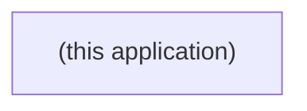

# Boundary — Inbound / Outbound

> **Derived view.** Regenerated from [`boundary.yaml`](./boundary.yaml) — do not
> hand-edit. Conventions and schema:
> [`governance/boundary-contract`](../../.github/skills/governance/boundary-contract/SKILL.md).

This file is a stub until the boundary contract is populated during P3/P5. It
will then carry the human-readable inbound/outbound tables and a mermaid
boundary diagram generated from `boundary.yaml`.

## Inbound

| id | kind | protocol | channel | from | entities | criticality | confidence |
|---|---|---|---|---|---|---|---|
| | | | | | | | |

## Outbound

| id | kind | protocol | channel | to | entities | criticality | confidence |
|---|---|---|---|---|---|---|---|
| | | | | | | | |

## Boundary diagram

