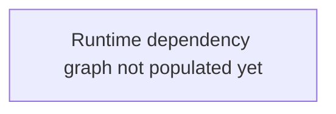

# Runtime Architecture

This file captures the production architecture observed through Dynatrace/APM or another verified production source. It should explain what actually runs, what surrounds the product and where runtime evidence differs from repository expectations.

## Scope

| Field | Value |
|---|---|
| Environment(s) | unknown |
| Dynatrace tenant / management zone | unknown |
| Time windows used | unknown |
| Entity mapping status | unknown |
| Last discovery snapshot | unknown |

## Observed Runtime Entities

| Entity | Type | Environment | Tags / management zone | Related repo component | Confidence | Evidence |
|---|---|---|---|---|---|---|
| | | | | | | |

## Product Ecosystem

| Adjacent system | Relationship | Direction | Protocol / channel | Observed evidence | Owner / team | Notes |
|---|---|---|---|---|---|---|
| | | | | | | |

## Service Dependency Graph

## Architecture Differences To Reconcile

| Observation | Code / catalog expectation | Dynatrace evidence | Status | Next action |
|---|---|---|---|---|
| | | | | |

## Observability Blind Spots

| Blind spot | Impact | Evidence | Required action |
|---|---|---|---|
| | | | |
