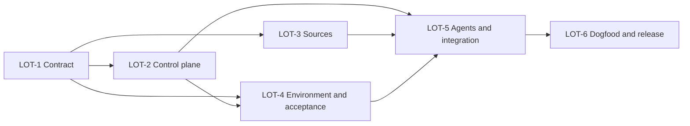

# Plan technique — Usine logicielle V3

## Découpage

| Lot | Résultat observable | Profil minimal | Dépend de |
|---|---|---|---|
| LOT-1 | spec V3, plan machine et fixtures de référence figés | expert | — |
| LOT-2 | automate/reducer/scheduler/capabilities et validator V3 exécutables | expert | LOT-1 |
| LOT-3 | source contracts et suppression complète de MCP readiness persistant | standard | LOT-1 |
| LOT-4 | environnement, CI, recette, preuves et delivery draft-only exécutables | expert | LOT-1, LOT-2 |
| LOT-5 | rôles, review/correction, intégration à l'existant, closeout et policy CI | expert | LOT-2, LOT-3, LOT-4 |
| LOT-6 | template, dogfood complet, réconciliation et release 1.2.0 | expert | LOT-5 |

## DAG

LOT-2 et LOT-3 peuvent démarrer dans la même vague car leurs surfaces
d'écriture sont disjointes. LOT-4 attend le contrat de contrôle ; toute
modification du plan repasse par le scheduler et invalide les allocations
existantes.

## Contrats par lot

### LOT-1 — contrat V3

Entrées : vision opérateur, code V1, règles foundations et corpus PGS. Sorties :
présent package approuvé et scénarios de régression généralisés. Non-objectif :
modifier le comportement du pack avant que le contrat soit lisible.

### LOT-2 — control plane

Créer des fonctions pures et un CLI sans dépendance pour valider/rejouer les
événements, calculer l'état, ordonnancer, réserver les chemins, contrôler les
capacités, calculer les digests et invalider les gates. Étendre le validator et
ses fixtures, en particulier états/templates V1 divergents et PGS LOT-3.

### LOT-3 — sources runtime

Introduire le contrat de source durable et le probe éphémère. Migrer chaque
référence à `mcp-readiness`, supprimer son fichier canonique et faire échouer
la validation si un état local revient dans le corpus. Préserver uniquement la
couverture historique d'un run.

### LOT-4 — environnement, recette et preuves

Fournir des contrats validables pour build/start/health/stop/reset, auth,
dépendances, données, secrets par référence, environnement distant, pipeline,
checks et identité de build. Créer campagne, résultats, mapping
critères/cas/assertions, provenance SHA et manifeste d'artefacts. Fournir un
scaffold Playwright officiel paramétrable,
sans dépendance imposée au pack, plus des fixtures capables de rejeter le faux
PASS PGS et une preuve d'un SHA précédent. Delivery ne peut que créer ou mettre
à jour une draft depuis une branche distante existante.

### LOT-5 — agents et intégration

Réécrire les handoffs autour des work packages/capabilities, structurer les
reviews, limiter les corrections, rendre la clôture corpus bloquante et faire
respecter les conventions observées sans refactor opportuniste. La policy
exécute la suite complète et publie les artefacts de validation.

### LOT-6 — dogfood et release

Migrer le template, rejouer le présent package par le contrôleur, exécuter deux
revues indépendantes (contrat puis implémentation), corriger, réconcilier docs
et corpus, mettre la version à 1.2.0 et produire le payload de draft PR.

## Stratégie de revue

- Revue de lot par un agent qui n'a pas écrit le lot, avec diff + contrat +
  résultats uniquement.
- Revue transversale après LOT-5 : invariants, sécurité/capacités, migration et
  contradiction des artefacts.
- Deux cycles de correction maximum par finding ; escalade sinon.
- Revue finale sur `candidate_sha` gelé et rerun intégral après toute correction.

## Budget

Diff attendu : 3 000–5 000 lignes, majoritairement schémas, templates, skills
et fixtures ; cœur JS inférieur à 1 500 lignes. Deux reviewers indépendants et
un passage de recette dogfood sont réservés. Le profil `economy` est interdit
sur LOT-2, LOT-4, LOT-5 et LOT-6 malgré d'éventuels petits diffs locaux.
