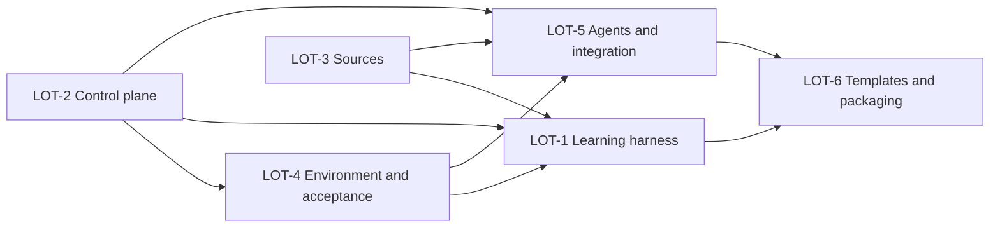

# Plan technique — Usine logicielle V3

## Découpage

| Lot | Résultat observable | Profil minimal | Dépend de |
|---|---|---|---|
| LOT-2 | automate/reducer/scheduler/capabilities et validator V3 exécutables | expert | — |
| LOT-3 | source contracts et suppression complète de MCP readiness persistant | standard | — |
| LOT-4 | environnement, CI, recette, preuves et delivery draft-only exécutables | expert | LOT-2 |
| LOT-1 | apprentissages promus liés à des régressions positives et négatives exécutables | expert | LOT-2, LOT-3, LOT-4 |
| LOT-5 | rôles, review/correction, intégration à l'existant, closeout et policy CI | expert | LOT-2, LOT-3, LOT-4 |
| LOT-6 | templates réutilisables et packaging 1.2.0 | expert | LOT-1, LOT-5 |

## DAG

LOT-2 et LOT-3 peuvent démarrer dans la même vague car leurs surfaces
d'écriture sont disjointes. LOT-4 attend le contrat de contrôle. LOT-1 et
LOT-5 peuvent ensuite vérifier en parallèle les apprentissages et
l'intégration, sur des surfaces disjointes. Toute
modification du plan repasse par le scheduler et invalide les allocations
existantes.

Amendement opérateur du 2026-08-26 : les objectifs, dépendances, critères,
modèles et ownership restent inchangés. Huit surfaces d'implémentation omises
de la première allocation sont ajoutées sous forme de claims `exact` : le
runner portable à LOT-1 ; les quatre scripts d'attestation/CI/release/staging à
LOT-4 ; `implementation-guard` à LOT-5 ; le moteur et l'entrée de mise à jour
du pack à LOT-6. Aucun artefact Functional Analyst, Planner, Controller ou
Corpus n'entre dans une claim d'implémentation.

## Contrats par lot

### LOT-1 — apprentissages exécutables

Lire le ledger produit par Corpus et vérifier que chaque apprentissage adopté
référence au moins un scénario positif et un scénario négatif réellement
exécutables. Le lot possède uniquement le catalogue, son schéma et son harnais
de test ; il ne possède ni le ledger sémantique, ni la spec, ni le plan, ni
l'état du contrôleur. Son mode `--contract-only` exclut volontairement les
tests d'intégration des templates, réservés au gate final.

### LOT-2 — control plane

Créer des fonctions pures et un CLI sans dépendance pour valider/rejouer les
événements, calculer l'état, ordonnancer, réserver les chemins, contrôler les
capacités, calculer les digests et invalider les gates. Étendre le validator et
ses fixtures, en particulier états/templates V1 divergents et PGS LOT-3. Le
résultat d'un lot lie la révision de base, chaque fichier présent ou supprimé,
les sorties fichier/arbre, les preuves de vérification et les blockers dans un
digest recalculable. L'append et la validation du package recomputent les
octets, l'absence des suppressions et l'inventaire récursif des arbres ; symlink
ou sortie du dépôt bloquent.

### LOT-3 — sources runtime

Introduire le contrat de source durable et le probe éphémère. Migrer chaque
référence à `mcp-readiness`, supprimer son fichier canonique et faire échouer
la validation si un état local revient dans le corpus. Préserver uniquement la
couverture historique d'un run.

### LOT-4 — environnement, recette et preuves

Fournir des contrats validables pour build/start/health/stop/reset, auth,
dépendances, données, secrets par référence, environnement distant, pipeline,
checks et identité de build. Créer campagne, résultats, mapping
critères/cas/assertions, provenance SHA et manifeste d'artefacts. Fournir un
scaffold Playwright officiel paramétrable,
sans dépendance imposée au pack, plus des fixtures capables de rejeter le faux
PASS PGS et une preuve d'un SHA précédent. Delivery ne peut que créer ou mettre
à jour une draft depuis une branche distante existante.

### LOT-5 — agents et intégration

Réécrire les handoffs autour des work packages/capabilities, structurer les
reviews, limiter les corrections, rendre la clôture corpus bloquante et faire
respecter les conventions observées sans refactor opportuniste. La policy
exécute la suite complète et publie les artefacts de validation.

### LOT-6 — templates et packaging

Migrer les templates racine et de démonstration, supprimer la double vérité V1,
mettre le pack à la version 1.2.0 et vérifier le contenu npm installable. Le lot
ne possède pas le package courant et ne réalise aucun gate sémantique.

## Ownership des artefacts hors lots

| Artefact | Propriétaire | Règle |
|---|---|---|
| `SPECIFICATION.md`, `IMPACTS.md`, `TESTS.md`, `SUMMARY.md`, `SUGGESTIONS.md`, `CHANGELOG.md`, `acceptance-plan.yaml` | Functional Analyst | jamais dans une write claim d'implémentation ; plan de recette gelé avant exécution Acceptance |
| `TECHNICAL_PLAN.md`, `factory/plan.v3.json` | Planner | proposition puis approbation opérateur |
| `factory/events.v3.jsonl`, `factory/state.v3.json` | Factory Controller | event log canonique et projection dérivée |
| résultats, preuves et rapport sous le run sélectionné | Acceptance | produits depuis le plan gelé, liés au candidat ; aucune écriture de spec/corpus |
| `JOURNAL.md` | Orchestrateur | provenance factuelle, sans raisonnement privé |
| corpus actif sous `doc/` | Corpus | réconciliation bloquante après revue consolidée |
| `PR_DESCRIPTION.md`, `pr-draft.yaml` | préparation fonctionnelle | Delivery les lit mais ne les écrit pas |

Après intégration de tous les lots, les rôles typés enchaînent hors du DAG
d'implémentation : vérification d'intégration, revue consolidée, closeout
Corpus, gel du candidat, recette/preuves, revue release, puis Delivery. Cette
séquence ne peut pas être absorbée dans LOT-6 sans créer une autorisation
circulaire.

## Stratégie de revue

- Revue de lot par un agent qui n'a pas écrit le lot, avec diff + contrat +
  résultats uniquement.
- Revue transversale après LOT-5 : invariants, sécurité/capacités, migration et
  contradiction des artefacts.
- Deux cycles de correction automatiques maximum par finding ; au-delà,
  l'opérateur peut autoriser exactement une tentative supplémentaire par
  événement typé lié au plan et au diff, ou maintenir le blocage.
- Revue finale sur `candidate_sha` gelé et rerun intégral après toute correction.

## Budget

Le budget initial de 3 000–5 000 lignes a été invalidé par les régressions de
sécurité découvertes en revue. Le diff mesuré avant gel final approche 19 000
lignes ajoutées, dont environ 11 500 lignes de runtime/tests JS. Deux reviewers
indépendants et un passage de recette dogfood sont réservés. Le profil
`economy` est interdit sur LOT-2, LOT-4, LOT-5 et LOT-6 malgré d'éventuels
petits diffs locaux.
