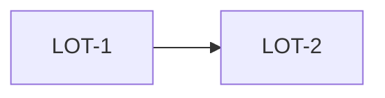

# Technical Intervention Plan — `<ticket-or-topic>`

<!--
Created only AFTER explicit human approval of the complete specification, and
before any implementation change. Three coherent artifacts in this package:

  TECHNICAL_PLAN.md   this file — rationale, lots, decisions, DAG, review plan
  technical-plan.yaml machine-readable lots, ownership, contracts, verification
  factory-state.yaml  current gate, allocation, lot, review and tested-SHA state

Partition by observable technical outcome, not by repository layer. A lot that
cannot be verified on its own is not a lot.
-->

## Approved acceptance criteria

<!-- Copy the IDs from the approved SPECIFICATION.md. Every one must be covered
     by at least one lot, and the coverage is checked, not asserted. -->

| ID | Criterion | Covered by |
|---|---|---|
| `AC1` | `<...>` | `LOT-n` |

## Lots

### `LOT-n` — `<observable objective>`

| Field | Value |
|---|---|
| Covers | `AC1, AC3` |
| Owned paths | `<paths this lot may write, exclusively, for its wave>` |
| Forbidden paths | `<paths it must not touch>` |
| Depends on | `<lot ids, or —>` |
| Risk | `low | medium | high` |
| Complexity | `bounded | reasoning` |
| Model role | `advanced | bounded_implementation` |
| Verification | `<what proves this lot done>` |
| Max attempts | `2` |

**Contract.** Inputs `<...>` · Outputs `<...>` · Invariants `<...>` · Non-goals `<...>`

## Execution DAG

<!-- Lots group into a wave only when they are dependency-ready AND their owned
     path sets are disjoint. One file has one owner per wave. Sequential by
     default; parallelism is an option, never an assumption. -->

| Wave | Lots | Rationale |
|---|---|---|
| 1 | `LOT-1` | `<...>` |

## Decisions and rejected alternatives

<!-- What was considered and deliberately not done. A legacy codebase accrues
     legitimate exceptions; recording why one was taken is what stops the next
     pass from "fixing" it. -->

| Decision | Why | Simpler alternative rejected because |
|---|---|---|
| `<...>` | `<...>` | `<...>` |

## Review plan

| Level | When | Reviewer |
|---|---|---|
| Lot review | after each lot verifies, before its result is integrated or consumed | not the implementing worker |
| Consolidated review | after integration verification, before corpus closeout | fresh context; receives spec, TIP, contracts, diff and test results — not the author's reasoning |
| Release readiness | after corpus closeout and acceptance | binds every artifact to the frozen tested SHA |

## Verification budget

<!-- Reviewer throughput is a real constraint and the usual cause of failure:
     generating changes faster than anyone can review them converts a delivery
     gain into a queue. State what this change costs to review. -->

| Field | Value |
|---|---|
| Expected diff size | `<lines / files>` |
| Expected review effort | `<...>` |
| Reviewer(s) | `<named, by code ownership>` |
