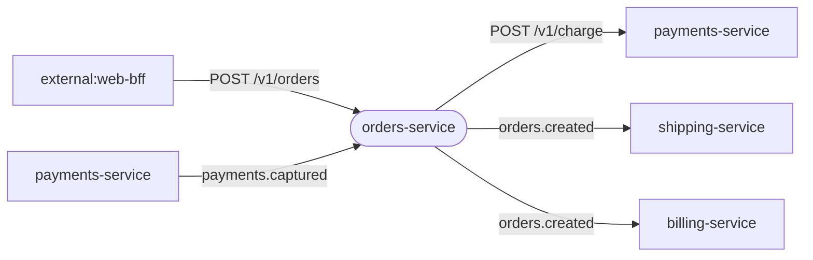

# Boundary — Inbound / Outbound

> **Derived view.** Regenerated from [`boundary.yaml`](./boundary.yaml) by
> `scripts/build-corpus-site.mjs` — do not hand-edit. Conventions:
> [`governance/boundary-contract`](../../.github/skills/governance/boundary-contract/SKILL.md).

**App:** Orders Service (`orders-service`) · repo `acme/orders-service`

## Inbound

| id | kind | protocol | channel | from | entities | criticality | confidence |
|---|---|---|---|---|---|---|---|
| in-create-order | sync-api | rest | POST /v1/orders | external:web-bff | Order | critical | confirmed |
| in-payment-captured | async-consume | kafka | payments.captured | payments-service | Payment | high | confirmed |

## Outbound

| id | kind | protocol | channel | to | entities | criticality | confidence |
|---|---|---|---|---|---|---|---|
| out-charge | sync-call | rest | POST /v1/charge | payments-service | Payment | critical | confirmed |
| out-order-created | async-produce | kafka | orders.created | shipping-service, billing-service | Order | high | confirmed |

## Boundary diagram

