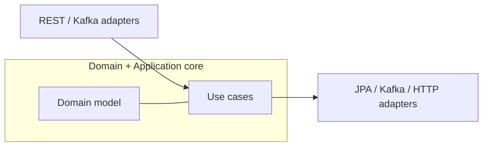

# Architecture style (P2)

Hexagonal (ports & adapters) over a Spring Boot service.

```mermaid
flowchart LR
  subgraph Core[Domain + Application core]
    D[Domain model]
    U[Use cases]
  end
  IN[REST / Kafka adapters] --> U
  U --> OUT[JPA / Kafka / HTTP adapters]
  D --- U
```
