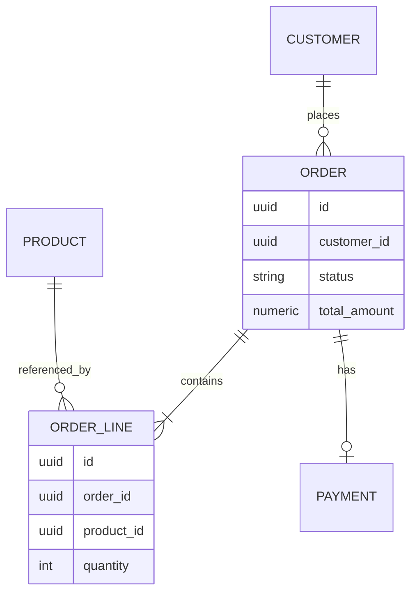

# Domain ER (P5 — from migrations)

```mermaid
erDiagram
  CUSTOMER ||--o{ ORDER : places
  ORDER ||--|{ ORDER_LINE : contains
  ORDER ||--o| PAYMENT : has
  PRODUCT ||--o{ ORDER_LINE : referenced_by
  ORDER {
    uuid id
    uuid customer_id
    string status
    numeric total_amount
  }
  ORDER_LINE {
    uuid id
    uuid order_id
    uuid product_id
    int quantity
  }
```
