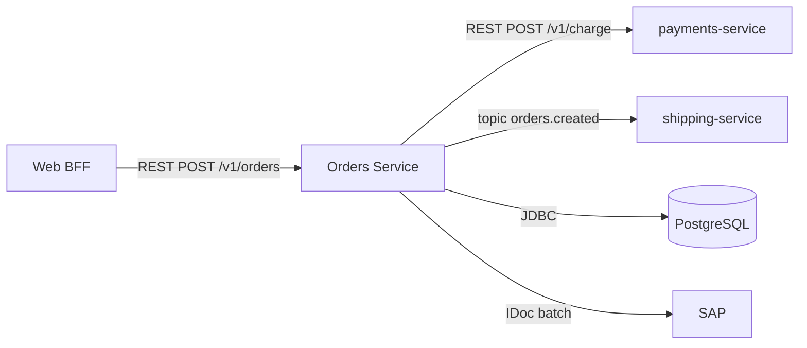

# Integration context (P5 — C4 context)

```mermaid
flowchart LR
  bff["Web BFF"] -->|REST POST /v1/orders| orders["Orders Service"]
  orders -->|REST POST /v1/charge| pay["payments-service"]
  orders -->|topic orders.created| ship["shipping-service"]
  orders -->|JDBC| pg[("PostgreSQL")]
  orders -->|IDoc batch| sap["SAP"]
```
