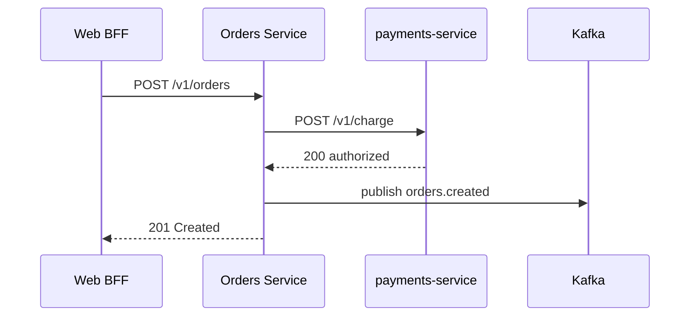

# Integration flow — checkout (P5)

```mermaid
sequenceDiagram
  participant BFF as Web BFF
  participant O as Orders Service
  participant P as payments-service
  participant K as Kafka
  BFF->>O: POST /v1/orders
  O->>P: POST /v1/charge
  P-->>O: 200 authorized
  O->>K: publish orders.created
  O-->>BFF: 201 Created
```
