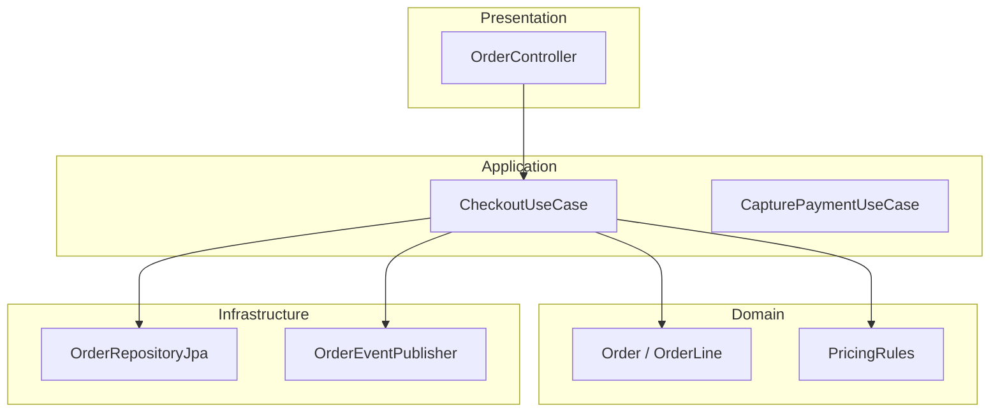

# Layers (P2)

```mermaid
flowchart TB
  subgraph Presentation
    C[OrderController]
  end
  subgraph Application
    UC[CheckoutUseCase]
    UC2[CapturePaymentUseCase]
  end
  subgraph Domain
    E[Order / OrderLine]
    R[PricingRules]
  end
  subgraph Infrastructure
    JPA[OrderRepositoryJpa]
    KP[OrderEventPublisher]
  end
  C --> UC --> E
  UC --> R
  UC --> JPA
  UC --> KP
```
