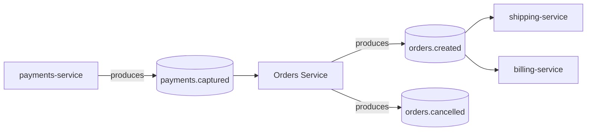

# Messaging topology (P5)

```mermaid
flowchart LR
  O["Orders Service"] -->|produces| T1[(orders.created)]
  O -->|produces| T2[(orders.cancelled)]
  T1 --> S["shipping-service"]
  T1 --> B["billing-service"]
  P["payments-service"] -->|produces| T3[(payments.captured)]
  T3 --> O
```
