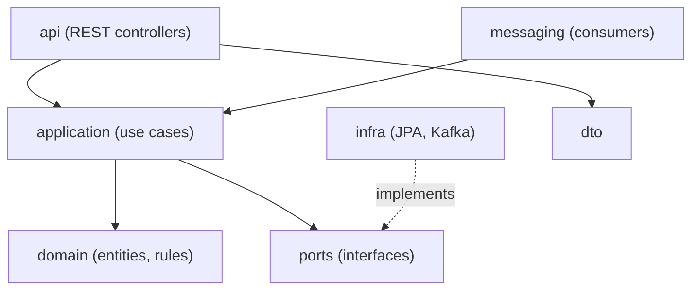

# Module dependency graph (P2)

```mermaid
flowchart TD
  api["api (REST controllers)"] --> app["application (use cases)"]
  app --> domain["domain (entities, rules)"]
  app --> ports["ports (interfaces)"]
  infra["infra (JPA, Kafka)"] -.implements.-> ports
  messaging["messaging (consumers)"] --> app
  api --> dto["dto"]
```
