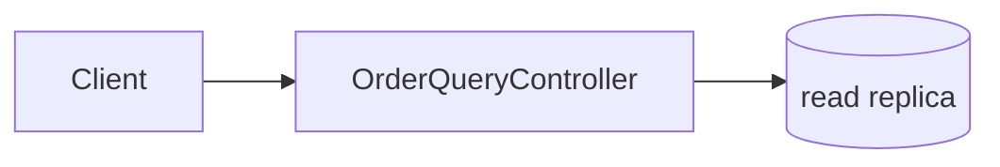

# Order History

Read-only views for a customer's past orders: `GET /v1/orders` (list) and `GET /v1/orders/{id}` (detail). Backed by a read replica.

```mermaid
flowchart LR
  C[Client] --> API[OrderQueryController]
  API --> RO[(read replica)]
```
