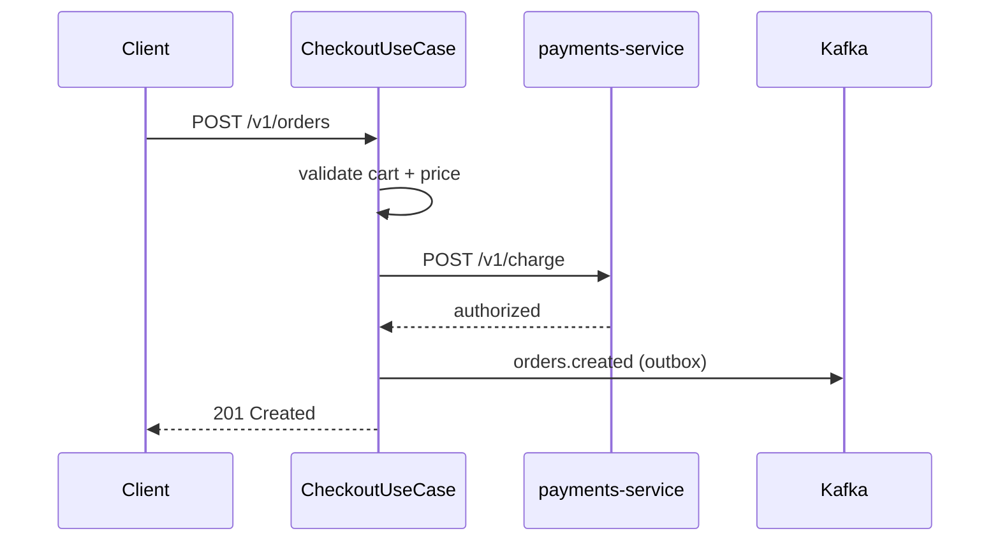

# Orders — Checkout

Turns a validated cart into a persisted order, authorizes payment synchronously, and publishes `orders.created` for downstream fulfillment. Entry point: `POST /v1/orders`.

## Flow

Key rules: total recomputed server-side; payment authorized before the order is confirmed; event emitted via transactional outbox so it cannot be lost.
