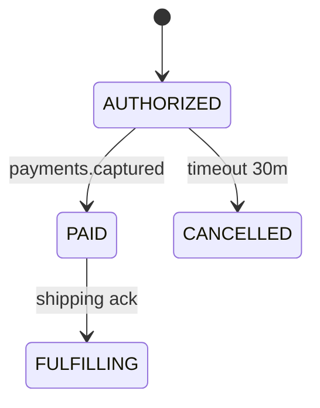

# Payment Capture

Consumes `payments.captured` from payments-service and moves the order from `AUTHORIZED` to `PAID`, then triggers fulfillment.

## State transition

Idempotent on the capture id; a duplicate `payments.captured` is a no-op.
